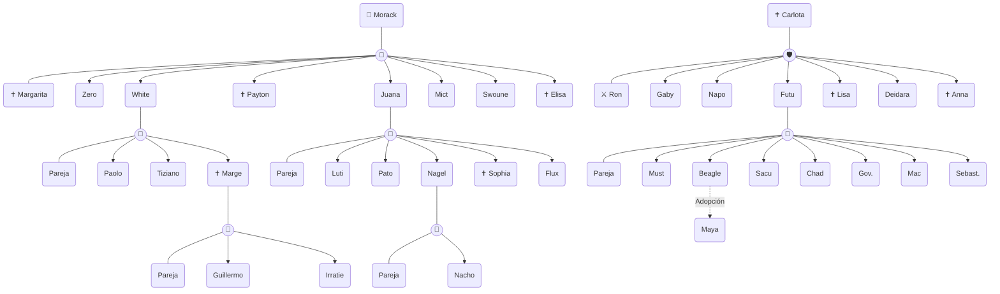

# 🌳 Árbol Genealógico de la Dinastía Helmreich

> [!info] Documento de Sangre
> Registro oficial y clasificado de las distintas ramas y descendencia de la Familia HMR, desde sus fundadores (Generación 0) hasta las generaciones vigentes. 
> *Los miembros fallecidos están marcados en el esquema visual y con el símbolo ✝️.*

## 📊 Mapa Genealógico Completo

---

## 📜 Archivo Histórico por Ramas

### 👑 Línea de Morack y Margarita
Los fundadores de la rama principal.

* **Primera Generación (Hijos):** 
  * [[Zero Helmreich]]
  * [[White Helmreich]]
  * [[Payton Helmreich]] (✝️)
  * [[Juana Helmreich]]
  * [[Mict Helmreich]]
  * [[Swoune Helmreich]]
  * [[Elisa Helmreich]] (✝️)

* **Segunda Generación (Nietos):**
  * *Hijos de White:* Paolo, Tiziano, Marge (✝️)
  * *Hijos de Juana:* Luti, Pato, Nagel, Sophia (✝️), Flux

* **Tercera Generación (Bisnietos):**
  * *Hijos de Marge:* Guillermo, Irratie
  * *Hijos de Nagel:* Nacho

### ⚔️ Línea de Carlota y Ron
La rama secundaria de la descendencia.

* **Primera Generación (Hijos):**
  * [[Gaby Helmreich]]
  * [[Napo Helmreich]]
  * [[Futu Helmreich]]
  * [[Lisa Helmreich]] (✝️)
  * [[Deidara Helmreich]]
  * [[Anna Helmreich]] (✝️)

* **Segunda Generación (Nietos):**
  * *Hijos de Futu:* Must, Beagle, Sacu, Chad, Governor, Mac, Sebastian

* **Tercera Generación (Bisnietos - Adopción):**
  * *Adoptada por Beagle:* [[Maya Helmreich]] (Canónicamente adoptada)
