# 🌳 Árbol Genealógico de la Dinastía Helmreich

> [!info] Documento de Sangre
> Registro oficial y clasificado de las distintas ramas y descendencia de la Familia HMR. Los miembros fallecidos están marcados con el símbolo ✝️ y fondo oscuro.

## 📊 Mapa Genealógico Completo

```mermaid
graph TD
    classDef dead fill:#3b1e1e,stroke:#f66,stroke-width:1px,color:#fff;
    classDef gen0 fill:#423011,stroke:#da5,stroke-width:2px,color:#fff;
    classDef union fill:#da5,stroke:#da5,color:#fff;
    classDef adopted fill:#1e273b,stroke:#8aa,stroke-width:1px,color:#fff,stroke-dasharray: 5 5;

    %% --- RAMA PRIMARIA ---
    Morack["👑 Morack Helmreich"]:::gen0 --- M_U(("💍")):::union --- Margarita["✝️ Margarita Helmreich"]:::dead
    
    M_U --> Zero["Zero Helmreich"]
    M_U --> White["White Helmreich"]
    M_U --> Payton["✝️ Payton Helmreich"]:::dead
    M_U --> Juana["Juana Helmreich"]
    M_U --> Mict["Mict Helmreich"]
    M_U --> Swoine["Swoine Helmreich"]
    M_U --> Elisa["✝️ Elisa Helmreich"]:::dead

    White --- W_U(("💍")):::union --- W_S["Pareja"]
    W_U --> Paolo["Paolo Helmreich"]
    W_U --> Tiziano["Tiziano Helmreich"]
    W_U --> Marge["✝️ Marge Helmreich"]:::dead

    Marge --- Ma_U(("💍")):::union --- Ma_S["Pareja"]
    Ma_U --> Guillermo["Guillermo Helmreich"]
    Ma_U --> Irratie["Irratie Helmreich"]

    Juana --- J_U(("💍")):::union --- J_S["Pareja"]
    J_U --> Luti["Luti Helmreich"]
    J_U --> Pato["Pato Helmreich"]
    J_U --> Nagel["Nagel Helmreich"]
    J_U --> Sophia["✝️ Sophia Helmreich"]:::dead
    J_U --> Flux["Flux Helmreich"]

    Nagel --- N_U(("💍")):::union --- N_S["Pareja"]
    N_U --> Nacho["Nacho Helmreich"]

    %% --- RAMA SECUNDARIA ---
    Carlota["✝️ Carlota Helmreich"]:::dead --- C_U(("🛡️")):::union --- Ron["⚔️ Ron Helmreich"]:::gen0

    C_U --> Gaby["Gaby Helmreich"]
    C_U --> Napo["Napo Helmreich"]
    C_U --> Futu["Futu Helmreich"]
    C_U --> Lisa["✝️ Lisa Helmreich"]:::dead
    C_U --> Deidara["Deidara Helmreich"]
    C_U --> Anna["✝️ Anna Helmreich"]:::dead

    Futu --- F_U(("💍")):::union --- F_S["Pareja"]
    F_U --> Must["Must Helmreich"]
    F_U --> Beagle["Beagle Helmreich"]
    F_U --> Sacu["Sacu Helmreich"]
    F_U --> Chad["Chad Helmreich"]
    F_U --> Governor["Governor Helmreich"]
    F_U --> Mac["Mac Helmreich"]
    F_U --> Sebastian["Sebastian Helmreich"]

    Beagle -. Adopcion .-> Maya["Maya Helmreich"]:::adopted
```

---

## 📜 Archivo Histórico por Ramas

### 👑 Línea de Morack y Margarita
Los fundadores de la rama principal.

* **Primera Generación (Hijos):** 
  * Zero, White, Payton (✝️), Juana, Mict, Swoine, Elisa (✝️)

* **Segunda Generación (Nietos):**
  * *Hijos de White:* Paolo, Tiziano, Marge (✝️)
  * *Hijos de Juana:* Luti, Pato, Nagel, Sophia (✝️), Flux

* **Tercera Generación (Bisnietos):**
  * *Hijos de Marge:* Guillermo, Irratie
  * *Hijos de Nagel:* Nacho

### ⚔️ Línea de Carlota y Ron
La rama secundaria de la descendencia.

* **Primera Generación (Hijos):**
  * Gaby, Napo, Futu, Lisa (✝️), Deidara, Anna (✝️)

* **Segunda Generación (Nietos):**
  * *Hijos de Futu:* Must, Beagle, Sacu, Chad, Governor, Mac, Sebastian

* **Tercera Generación (Bisnietos - Adopción):**
  * *Adoptada por Beagle:* Maya Helmreich (Canónicamente adoptada)
