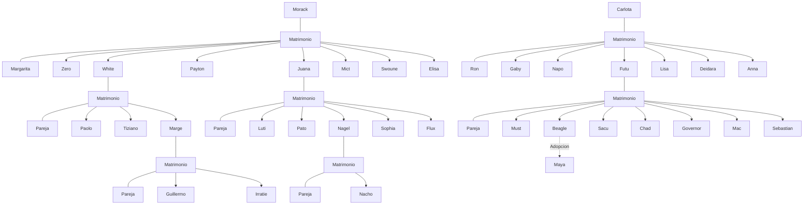

# 🌳 Árbol Genealógico

```mermaid
graph TD
    M[Morack] --- MU[Matrimonio] --- MA[Margarita]
    MU --> Z[Zero]
    MU --> W[White]
    MU --> P[Payton]
    MU --> J[Juana]
    MU --> MI[Mict]
    MU --> S[Swoune]
    MU --> E[Elisa]

    W --- WU[Matrimonio] --- WS[Pareja]
    WU --> P1[Paolo]
    WU --> T1[Tiziano]
    WU --> M1[Marge]

    M1 --- MAU[Matrimonio] --- MAS[Pareja]
    MAU --> G1[Guillermo]
    MAU --> I1[Irratie]

    J --- JU[Matrimonio] --- JS[Pareja]
    JU --> L1[Luti]
    JU --> PA1[Pato]
    JU --> N1[Nagel]
    JU --> SO1[Sophia]
    JU --> F1[Flux]

    N1 --- NU[Matrimonio] --- NS[Pareja]
    NU --> NA1[Nacho]

    C[Carlota] --- CU[Matrimonio] --- R[Ron]
    CU --> G2[Gaby]
    CU --> NA2[Napo]
    CU --> FU2[Futu]
    CU --> LI2[Lisa]
    CU --> DE2[Deidara]
    CU --> AN2[Anna]

    FU2 --- FUU[Matrimonio] --- FUS[Pareja]
    FUU --> MU3[Must]
    FUU --> BE3[Beagle]
    FUU --> SA3[Sacu]
    FUU --> CH3[Chad]
    FUU --> GO3[Governor]
    FUU --> MC3[Mac]
    FUU --> SE3[Sebastian]

    BE3 -. Adopcion .-> MY3[Maya]
```
